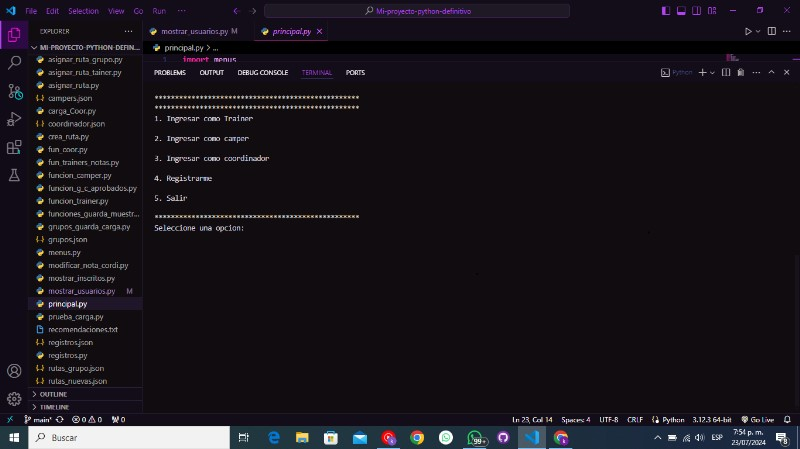

# Software Campuslands
Este programa permite que los usuarios se registren y pueden consultar sus datos,cuenta con el perfil del coordinador este perfil puede colocarle la nota del examen al usuario y dependiendo de la nota pasa a ser camper y no es suficiente se elimina automaticamente,tambien puede asignarle la ruta a los trainers y grupo a los campers, otro perfil que este programa es la del trainer, las funciones que tiene el trainer es colocarles notas y ver la ruta que y datos del trainer, el camper puede visualisar sus datos y sus notas, tmabien puede consultar la ruta, cada trainer y coordinador cuentan con una contraseña para ingresar a sus perfiles 

## Tabla de contenidos
| Indice | Titulo  |
|--|--|
| 1 | Coordinador 1 |
| 2 | Trainer 2 |
| 3 | Registrarme 3 |
| 4 | Camper 4 |


### Instalaciones 
Deberas ejecutar este comando para descargar 

```bash
sudo apt install app https://github.com/Kevinromero04/Proyecto-python-Kevin-Romero.git
```

# Tecnoogias  💻
- Html 
- Css


### Visualizacion



Hecho por [Kevin_Romero](https://github.com/Kevinromero04)

>Kevin Romero Rincon.

